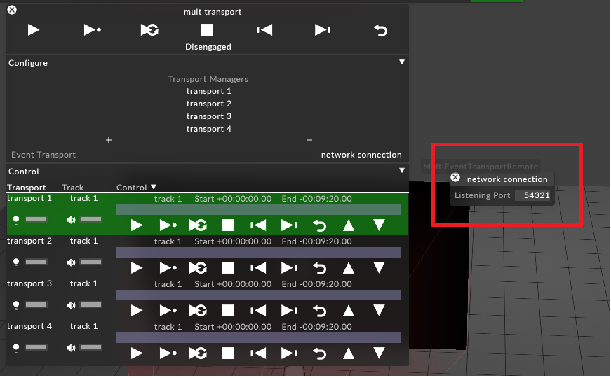
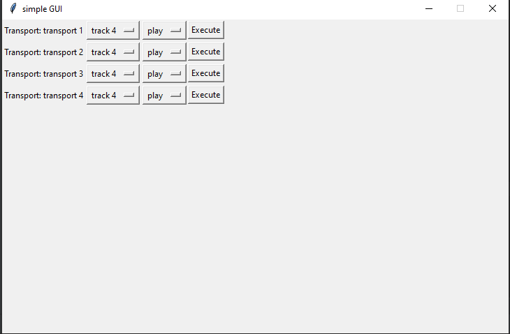

<H1> d3 telnet controller </H1>

 - d3_session_class.py:  The main part of of this project, provides a simple abstraction layer so you 
no longer need to write pure JSON formatted commands. 

- Controller.py: An example user interface that shows d3_session_class to dynamically draw its interface

 - main.py: sets up and calls controller.py
 
 
 To get this working you will need to have d3 running, with multi-transport control enabled 
 
 
 
 
 You will then have to have the correct IP address and port typed into the GUI of this program. 
 If you managed to connect properly then the resultant UI should look like this
 
 
 
  